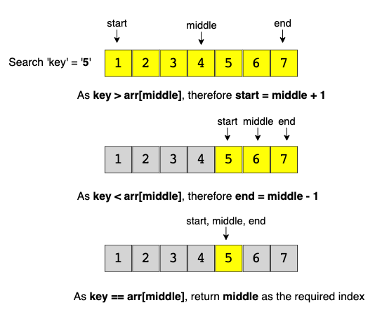

# Code Challenge 03: Array-Binary-Search

## Challenge Description
Write a function that takes in 2 parameters (sorted array, search key). Return index value of search key in array or -1 if not exist.

## Approach & Efficiency
- Take in an array and a search key
- Iterate through the array and a find the search key
- Return index value of search key, or -1 if not found.
> Big-O: - Time <-- 0(n) - Space <-- 0(n)

## Solution

