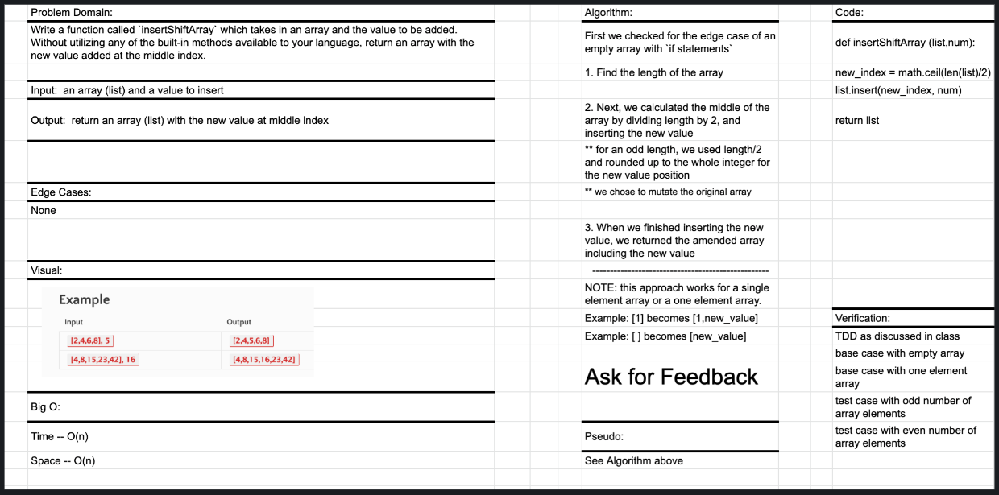

# Insert values into the middle of an array.

## Challenge Description

Write a function called `insertShiftArray` which takes in an array and the value to be added. Without utilizing any of the built-in methods available to your language, return an array with the new value added at the middle index.

### Example
| Input | Output |
| --- | --- |
| [2,4,6,8], 5 | [2,4,5,6,8] |
| [4,8,15,23,42], 16 | [4,8,15,16,23,42] |

## Approach & Efficiency
Take in the length of the array, divide by two and round up to the next largest whole integer. Use the rounded value to insert the value into the corresponding index location in the array. All lengths that return a float value are rounded up and inserted to the right of center in the array. 

## Solution

Resources:

[Stack_Overflow - How do you round UP a number in Python?](https://stackoverflow.com/questions/2356501/how-do-you-round-up-a-number-in-python)

[Stack_Overflow - Insert an element at a specific index in a list and return the updated list](https://stackoverflow.com/questions/14895599/insert-an-element-at-a-specific-index-in-a-list-and-return-the-updated-list)

